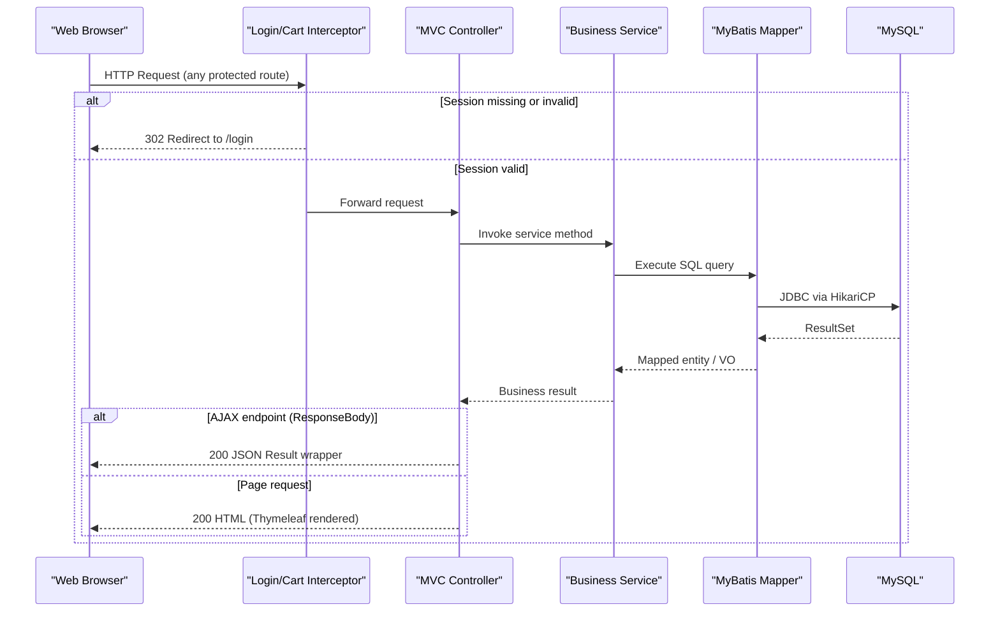

# API & Service Communication Contracts

**newbee-mall** exposes approximately **60 HTTP endpoints** across two portals — a public storefront and an admin back office — all served from a single monolithic Spring Boot application with no API gateway or inter-service communication.

## Service Catalog

| Service | Port | Category | Purpose |
|---|---|---|---|
| newbee-mall (monolith) | 28089 | Business | Single deployable unit hosting both the customer storefront and the admin management portal |

## API Endpoints Inventory

### Storefront (Mall) Endpoints

| Controller | Method | Path | Request Type | Response Type |
|---|---|---|---|---|
| IndexController | GET | `/index`, `/`, `/index.html` | — | HTML page (Thymeleaf) |
| GoodsController | GET | `/search`, `/search.html` | Query params (keyword, pageNumber) | HTML page |
| GoodsController | GET | `/goods/detail/{goodsId}` | Path: goodsId (Long) | HTML page |
| PersonalController | GET | `/login`, `/login.html` | — | HTML page |
| PersonalController | GET | `/register`, `/register.html` | — | HTML page |
| PersonalController | POST | `/login` | Form params (loginName, verifyCode, passwordMd5) | JSON `Result` |
| PersonalController | POST | `/register` | Form params (loginName, verifyCode, password) | JSON `Result` |
| PersonalController | GET | `/logout` | Session | Redirect |
| PersonalController | GET | `/personal` | Session | HTML page |
| PersonalController | POST | `/personal/updateInfo` | JSON body `MallUser` | JSON `Result` |
| PersonalController | GET | `/personal/addresses` | — | HTML page |
| ShoppingCartController | GET | `/shop-cart` | Session | HTML page |
| ShoppingCartController | POST | `/shop-cart` | JSON body `NewBeeMallShoppingCartItem` | JSON `Result` |
| ShoppingCartController | PUT | `/shop-cart` | JSON body `NewBeeMallShoppingCartItem` | JSON `Result` |
| ShoppingCartController | DELETE | `/shop-cart/{newBeeMallShoppingCartItemId}` | Path: itemId (Long) | JSON `Result` |
| ShoppingCartController | GET | `/shop-cart/settle` | Session | HTML page |
| OrderController | GET | `/saveOrder` | Session | Redirect to order detail |
| OrderController | GET | `/orders` | Query params, Session | HTML page |
| OrderController | GET | `/orders/{orderNo}` | Path: orderNo (String) | HTML page |
| OrderController | PUT | `/orders/{orderNo}/cancel` | Path: orderNo | JSON `Result` |
| OrderController | PUT | `/orders/{orderNo}/finish` | Path: orderNo | JSON `Result` |
| OrderController | GET | `/selectPayType` | Query: orderNo | HTML page |
| OrderController | GET | `/payPage` | Query: orderNo, payType | HTML page |
| OrderController | GET | `/paySuccess` | Query: orderNo, payType | JSON `Result` |
| CommonController | GET | `/common/mall/kaptcha` | — | Image (JPEG) |

### Admin Back Office Endpoints (`/admin/**`)

| Controller | Method | Path | Request Type | Response Type |
|---|---|---|---|---|
| AdminController | GET | `/admin/login` | — | HTML page |
| AdminController | POST | `/admin/login` | Form params (userName, password, verifyCode) | Redirect or HTML |
| AdminController | GET | `/admin/index`, `/admin/` | Session | HTML page |
| AdminController | GET | `/admin/profile` | Session | HTML page |
| AdminController | POST | `/admin/profile/password` | Form params | Plain text `String` |
| AdminController | POST | `/admin/profile/name` | Form params | Plain text `String` |
| AdminController | GET | `/admin/logout` | Session | Redirect |
| UploadController | POST | `/admin/upload/file` | Multipart file | JSON `Result` |
| UploadController | POST | `/admin/upload/files` | Multipart request | JSON `Result` |
| NewBeeMallCarouselController | GET | `/admin/carousels` | — | HTML page |
| NewBeeMallCarouselController | GET | `/admin/carousels/list` | Query params (page, limit) | JSON `Result` |
| NewBeeMallCarouselController | GET | `/admin/carousels/info/{id}` | Path: id (Integer) | JSON `Result` |
| NewBeeMallCarouselController | POST | `/admin/carousels/save` | JSON body `Carousel` | JSON `Result` |
| NewBeeMallCarouselController | POST | `/admin/carousels/update` | JSON body `Carousel` | JSON `Result` |
| NewBeeMallCarouselController | POST | `/admin/carousels/delete` | JSON body `Integer[]` | JSON `Result` |
| NewBeeMallGoodsCategoryController | GET | `/admin/categories` | Query: categoryLevel, parentId | HTML page |
| NewBeeMallGoodsCategoryController | GET | `/admin/categories/list` | Query params | JSON `Result` |
| NewBeeMallGoodsCategoryController | GET | `/admin/categories/listForSelect` | Query: categoryId | JSON `Result` |
| NewBeeMallGoodsCategoryController | GET | `/admin/categories/info/{id}` | Path: id (Long) | JSON `Result` |
| NewBeeMallGoodsCategoryController | POST | `/admin/categories/save` | JSON body `GoodsCategory` | JSON `Result` |
| NewBeeMallGoodsCategoryController | POST | `/admin/categories/update` | JSON body `GoodsCategory` | JSON `Result` |
| NewBeeMallGoodsCategoryController | POST | `/admin/categories/delete` | JSON body `Integer[]` | JSON `Result` |
| NewBeeMallGoodsController | GET | `/admin/goods` | — | HTML page |
| NewBeeMallGoodsController | GET | `/admin/goods/edit` | — | HTML page |
| NewBeeMallGoodsController | GET | `/admin/goods/edit/{goodsId}` | Path: goodsId (Long) | HTML page |
| NewBeeMallGoodsController | GET | `/admin/goods/list` | Query params | JSON `Result` |
| NewBeeMallGoodsController | GET | `/admin/goods/info/{id}` | Path: id (Long) | JSON `Result` |
| NewBeeMallGoodsController | POST | `/admin/goods/save` | JSON body `NewBeeMallGoods` | JSON `Result` |
| NewBeeMallGoodsController | POST | `/admin/goods/update` | JSON body `NewBeeMallGoods` | JSON `Result` |
| NewBeeMallGoodsController | PUT | `/admin/goods/status/{sellStatus}` | JSON body `Long[]` | JSON `Result` |
| NewBeeMallGoodsIndexConfigController | GET | `/admin/indexConfigs` | Query: configType | HTML page |
| NewBeeMallGoodsIndexConfigController | GET | `/admin/indexConfigs/list` | Query params | JSON `Result` |
| NewBeeMallGoodsIndexConfigController | GET | `/admin/indexConfigs/info/{id}` | Path: id (Long) | JSON `Result` |
| NewBeeMallGoodsIndexConfigController | POST | `/admin/indexConfigs/save` | JSON body `IndexConfig` | JSON `Result` |
| NewBeeMallGoodsIndexConfigController | POST | `/admin/indexConfigs/update` | JSON body `IndexConfig` | JSON `Result` |
| NewBeeMallGoodsIndexConfigController | POST | `/admin/indexConfigs/delete` | JSON body `Long[]` | JSON `Result` |
| NewBeeMallOrderController | GET | `/admin/orders` | — | HTML page |
| NewBeeMallOrderController | GET | `/admin/orders/list` | Query params | JSON `Result` |
| NewBeeMallOrderController | GET | `/admin/order-items/{id}` | Path: id (Long) | JSON `Result` |
| NewBeeMallOrderController | POST | `/admin/orders/update` | JSON body `NewBeeMallOrder` | JSON `Result` |
| NewBeeMallOrderController | POST | `/admin/orders/checkDone` | JSON body `Long[]` | JSON `Result` |
| NewBeeMallOrderController | POST | `/admin/orders/checkOut` | JSON body `Long[]` | JSON `Result` |
| NewBeeMallOrderController | POST | `/admin/orders/close` | JSON body `Long[]` | JSON `Result` |
| NewBeeMallUserController | GET | `/admin/users` | — | HTML page |
| NewBeeMallUserController | GET | `/admin/users/list` | Query params | JSON `Result` |
| NewBeeMallUserController | POST | `/admin/users/lock/{lockStatus}` | JSON body `Integer[]` | JSON `Result` |
| CommonController | GET | `/common/kaptcha` | — | Image (JPEG) |

## Management & Observability Endpoints

| Service | Endpoint | Notes |
|---|---|---|
| newbee-mall | None exposed | No Spring Boot Actuator, no Swagger/OpenAPI, no health check, no metrics endpoint configured |

No management, health, or metrics endpoints are available. The application does not declare `spring-boot-starter-actuator` as a dependency.

## DTOs & Contracts

**Entity classes used directly as request/response bodies:**

- `Carousel` — used as both request body (save/update) and response payload in carousel admin APIs
- `GoodsCategory` — used as both request body (save/update) and response payload in category admin APIs
- `NewBeeMallGoods` — used as request body for product save/update; returned in goods info responses
- `NewBeeMallOrder` — used as request body for admin order update; returned in order detail responses
- `NewBeeMallShoppingCartItem` — used as request body for cart add/update operations
- `MallUser` — used as request body in user profile update
- `IndexConfig` — used as request body for homepage config save/update
- `StockNumDTO` — internal DTO used to batch-update stock during order creation

**View Object (VO) classes used as response models:**

- `NewBeeMallGoodsDetailVO` — product detail page response
- `NewBeeMallIndexCarouselVO`, `NewBeeMallIndexCategoryVO`, `NewBeeMallIndexConfigGoodsVO` — homepage composites
- `NewBeeMallOrderDetailVO`, `NewBeeMallOrderListVO`, `NewBeeMallOrderItemVO` — order views
- `NewBeeMallShoppingCartItemVO` — cart item view
- `NewBeeMallUserVO` — user profile view
- `NewBeeMallSearchGoodsVO`, `SearchPageCategoryVO`, `SecondLevelCategoryVO`, `ThirdLevelCategoryVO` — search and category views

**Common response wrapper:** All AJAX endpoints return `ltd.newbee.mall.util.Result` (a simple envelope with `resultCode`, `message`, and `data` fields). Paginated list responses use `PageResult`.

**No OpenAPI/Swagger, no protobuf, no GraphQL schemas** are present. Serialization uses Spring MVC's default Jackson ObjectMapper with no custom configuration. Entity classes are plain POJOs (no Lombok); none are declared immutable.

## Communication Patterns

**Synchronous only.** All request handling is synchronous and single-threaded within Spring MVC. There is no asynchronous processing, no message queue, and no event-driven pattern.

**Intra-process only.** The application is a monolith with no inter-service HTTP calls, no Feign client, no RestTemplate or WebClient, and no service discovery.

**No resilience patterns.** There is no circuit breaker (Resilience4j, Hystrix), no retry policy, and no timeout configuration beyond the HikariCP connection timeout (30 s).

**Security posture:** There is **no Spring Security, no JWT, no OAuth2, and no TLS/HTTPS configured**. Authentication is implemented entirely through custom `HandlerInterceptor` classes that check for a user or admin object in the HTTP session. Passwords are stored and compared as MD5 hashes (no bcrypt or salting). All endpoints are accessible over plain HTTP; there is no transport security. The admin portal is only protected by session presence — no CSRF protection is configured.

**No API versioning.** All endpoints use unversioned URL paths.

**Session management:** User identity is carried in the HTTP session (`HttpSession`), stored in-process (Spring Session Core with the default in-memory store — no Redis or JDBC backing store).

## Service Technology Matrix

| Service | Web Framework | Data Access | Discovery | Gateway | Actuator | Cache | Metrics |
|---|---|---|---|---|---|---|---|
| newbee-mall | Spring MVC + Thymeleaf | MyBatis (XML mappers) | None | None | None | None | None |

## Service Communication Sequence

