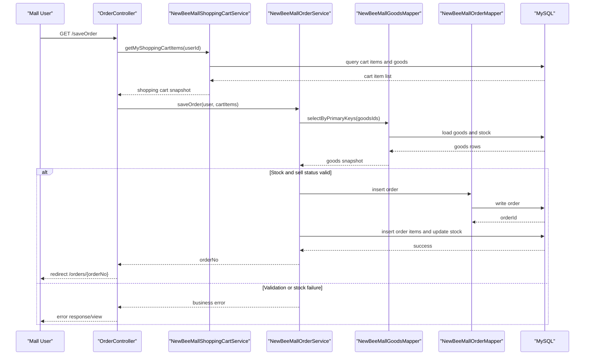

# API & Service Communication Contracts

The application exposes a broad MVC/API surface for storefront and admin operations, primarily over synchronous HTTP request/response flows in a single deployable service.

## Service Catalog

| Service | Port | Category | Purpose |
|---|---:|---|---|
| `newbee-mall` | 28089 | Business | Monolithic Spring Boot service that serves admin and mall pages/APIs |

## API Endpoints Inventory

| Service | Method | Path | Request Type | Response Type |
|---|---|---|---|---|
| newbee-mall | GET | `/admin/login` | Query only | Thymeleaf view |
| newbee-mall | POST | `/admin/login` | form fields: `userName,password,verifyCode` | redirect/view |
| newbee-mall | GET | `/admin/orders` | query pagination | Thymeleaf view |
| newbee-mall | GET | `/admin/orders/list` | query pagination | JSON page result |
| newbee-mall | POST | `/admin/orders/checkDone` | body: order id array | JSON result |
| newbee-mall | POST | `/admin/orders/checkOut` | body: order id array | JSON result |
| newbee-mall | POST | `/admin/orders/close` | body: order id array | JSON result |
| newbee-mall | GET | `/search` | query params (`keyword`, paging, filters) | Thymeleaf view |
| newbee-mall | GET | `/goods/detail/{goodsId}` | path: `goodsId` | Thymeleaf view |
| newbee-mall | GET | `/shop-cart` | session user context | Thymeleaf view |
| newbee-mall | POST | `/shop-cart` | JSON cart item DTO | JSON result |
| newbee-mall | PUT | `/shop-cart` | JSON cart item DTO | JSON result |
| newbee-mall | DELETE | `/shop-cart/{newBeeMallShoppingCartItemId}` | path: cart item id | JSON result |
| newbee-mall | GET | `/saveOrder` | session user context | redirect to order detail |
| newbee-mall | GET | `/orders` | query pagination + session user | Thymeleaf view |
| newbee-mall | GET | `/orders/{orderNo}` | path: `orderNo` | Thymeleaf view |
| newbee-mall | PUT | `/orders/{orderNo}/cancel` | path: `orderNo` | JSON result |
| newbee-mall | PUT | `/orders/{orderNo}/finish` | path: `orderNo` | JSON result |
| newbee-mall | GET | `/selectPayType` | query: `orderNo` | Thymeleaf view |
| newbee-mall | GET | `/payPage` | query: `orderNo,payType` | Thymeleaf view |
| newbee-mall | GET | `/paySuccess` | query: `orderNo,payType` | JSON result |
| newbee-mall | POST | `/login` | form login credentials + captcha | JSON result |
| newbee-mall | POST | `/register` | form registration fields + captcha | JSON result |
| newbee-mall | POST | `/personal/updateInfo` | form profile fields | JSON result |
| newbee-mall | GET | `/common/kaptcha` | none | image stream |
| newbee-mall | POST | `/admin/upload/file` | multipart image | JSON URL |

## Management & Observability Endpoints

| Service | Endpoint | Custom Metrics (if any) |
|---|---|---|
| newbee-mall | Not explicitly configured (`/actuator/*` not found) | None identified |

## DTOs & Contracts

Service-level contract models include `AdminUser`, `MallUser`, `NewBeeMallGoods`, `GoodsCategory`, `NewBeeMallShoppingCartItem`, `NewBeeMallOrder`, `NewBeeMallOrderItem`, and request/response VOs like `NewBeeMallUserVO`, `NewBeeMallShoppingCartItemVO`, `NewBeeMallOrderDetailVO`, `NewBeeMallOrderItemVO`, and `StockNumDTO`. These are mutable POJO-style models serialized via Jackson (Spring Boot defaults). No dedicated gateway aggregation DTO layer, protobuf schemas, or GraphQL schemas were identified. Validation failures are generally surfaced as business errors with corresponding result payloads/status semantics.

## Communication Patterns

Communication is predominantly synchronous and in-process: Controllers call Services, then MyBatis Mappers execute SQL against MySQL. No asynchronous broker patterns (Kafka/RabbitMQ), service discovery, API gateway, or client-side load-balancing patterns were detected. Resilience policies like circuit breakers/retries/timeouts are not explicitly configured. Startup dependency relevant to API availability is simple: application startup requires reachable MySQL due to datasource configuration. Security posture at API contract level is session-based access control through MVC interceptors for admin and protected mall paths; TLS/auth proxy configuration is not defined in repository-level runtime config.

## Service Technology Matrix

| Service | Web | Data Access | Discovery | Gateway | Actuator | Cache | Metrics |
|---|---|---|---|---|---|---|---|
| newbee-mall | Spring MVC + Thymeleaf | MyBatis + MySQL | none | none | no explicit config | none detected | none detected |

## Service Communication Sequence

