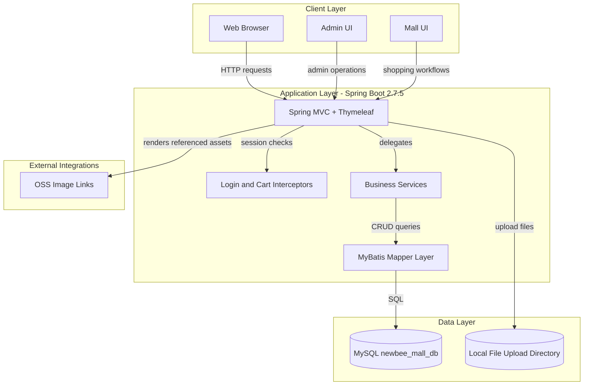
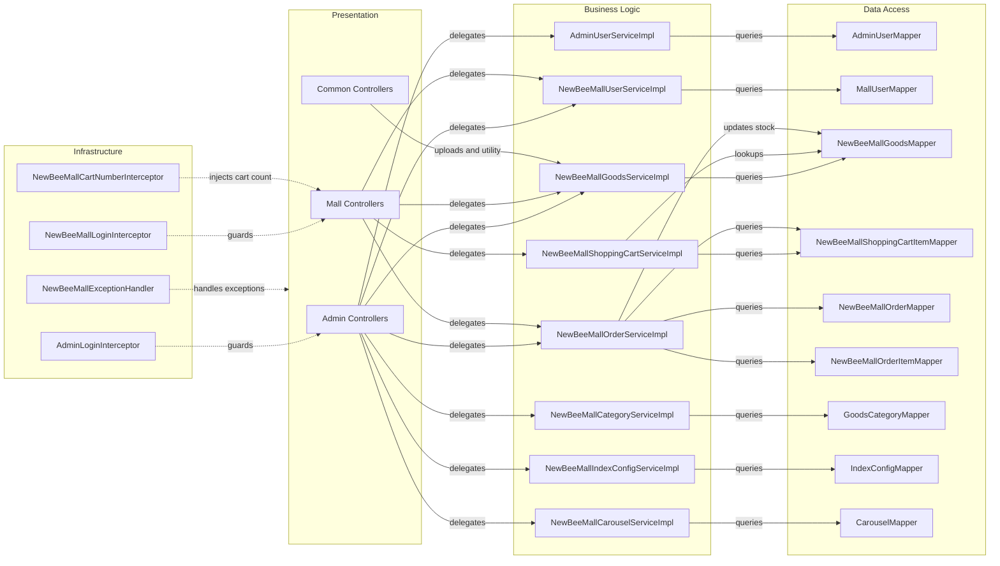

# Architecture Diagram

This document summarizes the high-level architecture and internal component relationships for newbee-mall.

## Application Architecture

### Technology Stack Summary

| Layer | Technology | Version | Purpose |
|---|---|---|---|
| Presentation | Spring MVC, Thymeleaf | Spring Boot managed (2.7.5 BOM) | Server-side page rendering and request handling |
| Business | Spring Service components | Spring Boot managed | Order, cart, user, goods, and admin logic |
| Data Access | MyBatis Spring Boot Starter | 2.2.2 | Mapper-based persistence |
| Database | MySQL | runtime driver managed by Spring Boot BOM | Transactional data storage |
| Runtime | Java | 1.8 | Application runtime |

### Data Storage & External Services

The application stores business data in a single MySQL database (`newbee_mall_db`) and stores uploaded images/files in a local filesystem directory mapped under `/upload/**` and `/goods-img/**`. It also references external image URLs in seeded carousel/config data.

### Key Architectural Decisions

- Monolithic Spring Boot web application with both storefront and admin capabilities in one deployable unit.
- Layered architecture using Controllers -> Services -> MyBatis Mapper interfaces/XML.
- Session-based authentication and authorization checks implemented with MVC interceptors.

## Component Relationships

### Component Inventory

| Component | Layer | Type | Responsibility |
|---|---|---|---|
| `AdminController` + admin resource controllers | Presentation | MVC Controller | Back-office login and operational management |
| `PersonalController`, `GoodsController`, `ShoppingCartController`, `OrderController`, `IndexController` | Presentation | MVC Controller | Customer login, browsing, cart, and order flows |
| `NewBeeMallOrderServiceImpl` | Business | Service | Order lifecycle, stock updates, payment status transitions |
| `NewBeeMallShoppingCartServiceImpl` | Business | Service | Cart add/update/delete and cart snapshot composition |
| `NewBeeMallGoodsServiceImpl` | Business | Service | Product listing, search, and admin product management |
| `NewBeeMallUserServiceImpl` | Business | Service | Mall user registration, login, profile updates |
| `AdminUserServiceImpl` | Business | Service | Admin identity management |
| `*Mapper` interfaces + MyBatis XML | Data Access | Mapper | SQL execution and persistence mapping |
| `AdminLoginInterceptor`, `NewBeeMallLoginInterceptor`, `NewBeeMallCartNumberInterceptor` | Infrastructure | Interceptor | Session and page access control, cart count enrichment |
| `NewBeeMallExceptionHandler` | Infrastructure | Advice | Global exception mapping for JSON/view responses |
