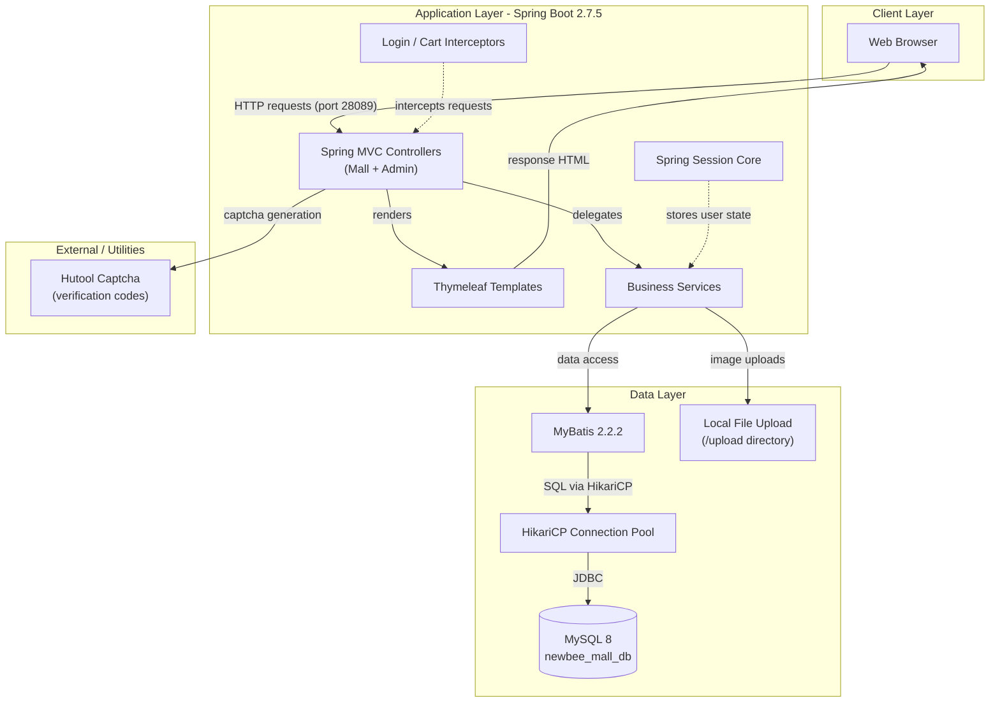
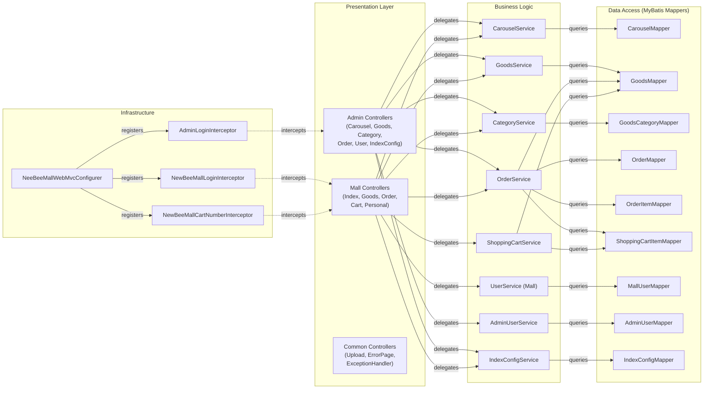

# Architecture Diagram

This document describes the architecture of **newbee-mall**, a Spring Boot-based e-commerce platform that uses Thymeleaf for server-side rendering, MyBatis for data access, and MySQL as its primary data store.

## Application Architecture

### Technology Stack Summary

| Layer | Technology | Version | Purpose |
|---|---|---|---|
| Presentation | Spring MVC + Thymeleaf | Spring Boot 2.7.5 | Server-side HTML rendering for mall and admin portals |
| Business Logic | Plain Spring Services | Spring Boot 2.7.5 | Order, goods, user, cart, category and carousel logic |
| Data Access | MyBatis (mybatis-spring-boot-starter) | 2.2.2 | SQL mapping via XML mapper files |
| Database | MySQL (mysql-connector-java) | runtime | Relational data store (`newbee_mall_db`) |
| Connection Pool | HikariCP | bundled | High-performance JDBC connection pooling |
| Session | Spring Session Core | Spring Boot 2.7.5 | HTTP session management |
| Utilities | Hutool Captcha | 5.8.7 | Image-based CAPTCHA generation |
| Build | Spring Boot Maven Plugin | 2.7.5 | Executable JAR packaging |

### Data Storage & External Services

The application uses a single **MySQL** database (`newbee_mall_db`, default port 3306) accessed through **HikariCP** connection pooling with a maximum pool size of 15 connections. There is no external cache (Redis, Memcached) or message broker. Uploaded images (product pictures, carousel banners) are stored directly on the local filesystem under an `upload` directory served as a static resource. There are no third-party API integrations — captcha images are generated in-process by Hutool.

### Key Architectural Decisions

- **Monolithic server-side rendered application**: The entire mall (storefront and admin back office) is packaged as a single executable Spring Boot JAR, with Thymeleaf templates rendering full HTML pages — there is no REST API separation.
- **MyBatis with XML mappers**: Data access is implemented through hand-written SQL in XML mapper files (`classpath:mapper/*Mapper.xml`) rather than an ORM like JPA/Hibernate, giving fine-grained SQL control.
- **Interceptor-based security**: Authentication and authorisation are enforced through Spring MVC `HandlerInterceptor` implementations (`AdminLoginInterceptor`, `NewBeeMallLoginInterceptor`, `NewBeeMallCartNumberInterceptor`) registered via `NeeBeeMallWebMvcConfigurer` — no Spring Security dependency is used.

## Component Relationships

### Component Inventory

| Component | Layer | Type | Responsibility |
|---|---|---|---|
| AdminController | Presentation | MVC Controller | Admin login/logout page routing |
| NewBeeMallCarouselController | Presentation | MVC Controller | CRUD for homepage carousel banners (admin) |
| NewBeeMallGoodsController | Presentation | MVC Controller | Product listing, add/edit/delete (admin) |
| NewBeeMallGoodsCategoryController | Presentation | MVC Controller | Category management (admin) |
| NewBeeMallGoodsIndexConfigController | Presentation | MVC Controller | Homepage featured-goods configuration (admin) |
| NewBeeMallOrderController (admin) | Presentation | MVC Controller | Order management and status updates (admin) |
| NewBeeMallUserController | Presentation | MVC Controller | Mall user listing (admin) |
| IndexController | Presentation | MVC Controller | Homepage rendering for storefront |
| GoodsController | Presentation | MVC Controller | Product listing and detail pages |
| OrderController | Presentation | MVC Controller | Order placement, payment, cancellation |
| ShoppingCartController | Presentation | MVC Controller | Cart add/update/remove/checkout |
| PersonalController | Presentation | MVC Controller | User profile and personal order history |
| UploadController | Presentation | MVC Controller | File upload endpoint |
| CommonController | Presentation | MVC Controller | Common pages (login, register, captcha) |
| NewBeeMallCarouselServiceImpl | Business Logic | Service | Carousel CRUD and ordering |
| NewBeeMallGoodsServiceImpl | Business Logic | Service | Product search, paging, stock management |
| NewBeeMallCategoryServiceImpl | Business Logic | Service | Three-level category tree management |
| NewBeeMallOrderServiceImpl | Business Logic | Service | Order creation, payment, cancellation, stock update |
| NewBeeMallShoppingCartServiceImpl | Business Logic | Service | Cart item management and checkout preparation |
| NewBeeMallUserServiceImpl | Business Logic | Service | User registration, login, password update |
| AdminUserServiceImpl | Business Logic | Service | Admin user authentication |
| NewBeeMallIndexConfigServiceImpl | Business Logic | Service | Homepage featured-goods config management |
| CarouselMapper | Data Access | MyBatis Mapper | SQL for carousel table |
| NewBeeMallGoodsMapper | Data Access | MyBatis Mapper | SQL for goods table |
| GoodsCategoryMapper | Data Access | MyBatis Mapper | SQL for category table |
| NewBeeMallOrderMapper | Data Access | MyBatis Mapper | SQL for orders table |
| NewBeeMallOrderItemMapper | Data Access | MyBatis Mapper | SQL for order items table |
| NewBeeMallShoppingCartItemMapper | Data Access | MyBatis Mapper | SQL for shopping cart table |
| MallUserMapper | Data Access | MyBatis Mapper | SQL for mall users table |
| AdminUserMapper | Data Access | MyBatis Mapper | SQL for admin users table |
| IndexConfigMapper | Data Access | MyBatis Mapper | SQL for index config table |
| AdminLoginInterceptor | Infrastructure | Interceptor | Enforces admin session authentication |
| NewBeeMallLoginInterceptor | Infrastructure | Interceptor | Enforces storefront user session authentication |
| NewBeeMallCartNumberInterceptor | Infrastructure | Interceptor | Injects cart item count into model for storefront |
| NeeBeeMallWebMvcConfigurer | Infrastructure | Configuration | Registers interceptors and static resource paths |
