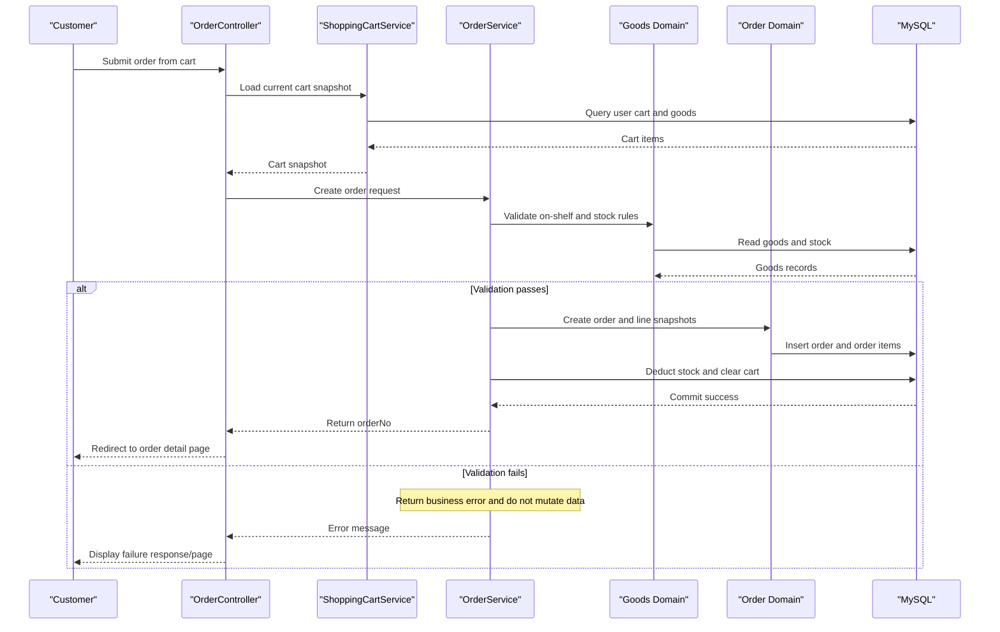

# Core Business Workflows

newbee-mall supports end-to-end online shopping workflows for customers and operational workflows for administrators. Core processes include account access, catalog discovery, shopping cart management, and order lifecycle handling.

## Domain Entities

| Entity | Service / Bounded Context | Description | Key Relationships |
|---|---|---|---|
| MallUser | User Account | Customer account and profile context | Places orders, owns cart items |
| AdminUser | Admin Operations | Back-office operator identity | Maintains goods, categories, carousel, index config |
| NewBeeMallGoods | Catalog | Sellable product metadata and inventory | Belongs to category, referenced in cart/order/config |
| GoodsCategory | Catalog Taxonomy | Multi-level category hierarchy | Parent-child hierarchy, groups goods |
| NewBeeMallShoppingCartItem | Shopping Cart | User-selected items before checkout | References MallUser and Goods |
| NewBeeMallOrder | Order Management | Order header and lifecycle state | Belongs to MallUser, contains order items |
| NewBeeMallOrderItem | Order Management | Immutable item snapshot at purchase | References order and goods |
| Carousel | Homepage Content | Marketing banner configuration | Managed by admins |
| IndexConfig | Homepage Content | Curated product placement configuration | References goods |

## Service-to-Domain Mapping

| Service | Domain Context | Owned Entities | External Dependencies |
|---|---|---|---|
| `NewBeeMallUserService` | User Account | MallUser | `MallUserMapper`, HTTP session |
| `AdminUserService` | Admin Identity | AdminUser | `AdminUserMapper`, captcha session state |
| `NewBeeMallGoodsService` | Catalog | NewBeeMallGoods, GoodsCategory | `NewBeeMallGoodsMapper`, `GoodsCategoryMapper`, `IndexConfigMapper` |
| `NewBeeMallShoppingCartService` | Shopping Cart | NewBeeMallShoppingCartItem | `NewBeeMallShoppingCartItemMapper`, `NewBeeMallGoodsMapper` |
| `NewBeeMallOrderService` | Order Management | NewBeeMallOrder, NewBeeMallOrderItem | order/cart/goods mappers, transactional DB operations |
| `NewBeeMallCarouselService` | Homepage Content | Carousel | `CarouselMapper` |
| `NewBeeMallIndexConfigService` | Homepage Content | IndexConfig | `IndexConfigMapper`, `NewBeeMallGoodsMapper` |

## Primary Workflows

### Workflow 1: Customer checkout and order creation

1. Authenticated user opens cart and reviews selected goods.
2. User triggers order creation (`/saveOrder`).
3. System validates address availability, cart non-empty state, goods selling status, and stock sufficiency.
4. Transactional order creation occurs: delete cart items, deduct stock, create order header, create order items.
5. User is redirected to order details and can continue pay/cancel/finish actions based on status checks.

Business rules involved: stock cannot be negative, off-shelf goods cannot be ordered, order total must be positive, and user can only operate on own orders.

### Workflow 2: Admin order processing lifecycle

1. Admin queries orders in backend management pages.
2. Admin executes state transitions (`checkDone`, `checkOut`, `close`) in batches.
3. Each transition validates current order state and deletion flags.
4. Close operation recovers inventory quantities.

Business rules involved: only eligible statuses may transition; invalid orders are aggregated and returned as user-visible error messages.

### Workflow 3: User account access and profile maintenance

1. User/admin login requires credentials and captcha verification.
2. Session attributes are created on successful login.
3. Profile updates sanitize text input before persistence.
4. Locked users are denied login.

## Cross-Service Data Flows

This repository implements a single deployable service, so cross-domain composition happens inside one process. Order flows combine cart data, goods stock data, and user profile/address data before persistence. Admin management flows aggregate category/goods/index configuration and order summaries for operational pages. When validations fail (e.g., stock shortage, ownership mismatch, invalid status), the flow degrades to business error responses instead of state mutation.

## Business Workflow Sequence

## Business Rules & Decision Logic

- **Validation rules**: Captcha required for login/registration; non-empty credentials; non-empty address for checkout; cart cannot be empty; per-item cart limits and total cart limits.
- **Decision logic**: Order and admin actions branch on current order status; payment page selection branches on `payType`; profile update applies sanitized values only when present.
- **State transitions**: Order statuses move through pre-pay, paid, done, out-stock, finished, or closed states with strict transition checks.
- **Data integrity rules**: Order creation and close/recovery operations are transactional; stock update failures abort order creation.
- **Authorization constraints**: Session-based interceptors and per-order userId checks enforce owner-only operations for customer order actions.
