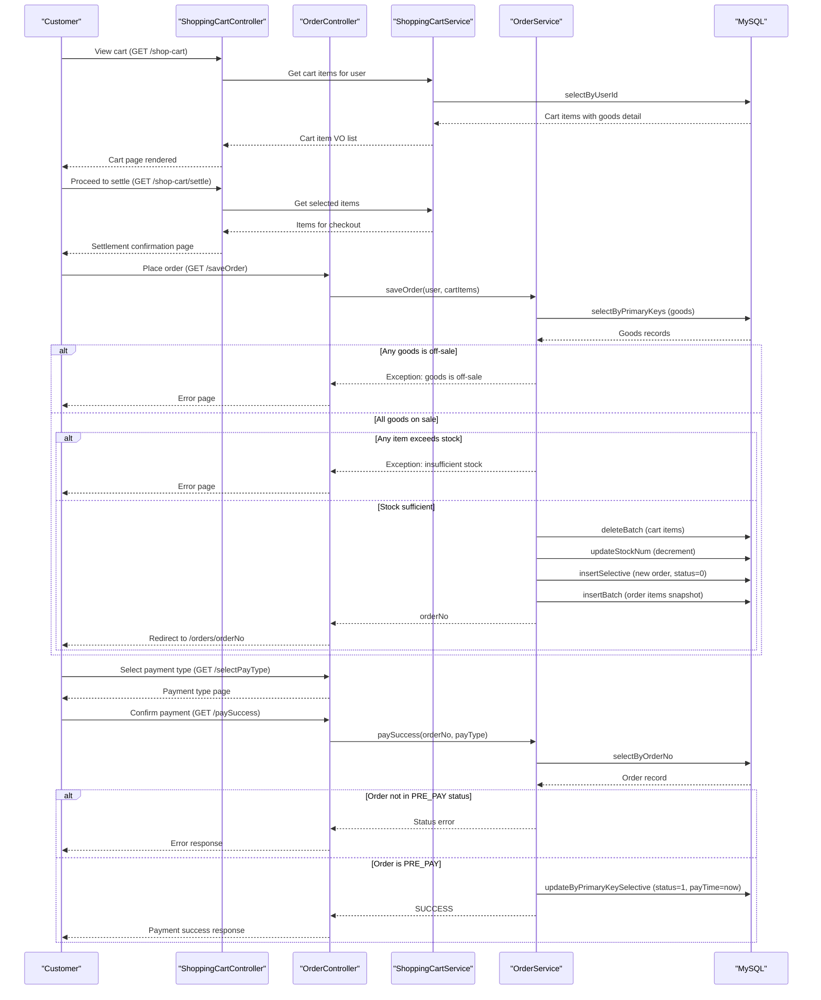

# Core Business Workflows

**newbee-mall** is an e-commerce platform that enables customers to browse and purchase goods through a storefront portal, while administrators manage products, orders, categories, and users through a back-office portal.

## Domain Entities

| Entity | Service / Bounded Context | Description | Key Relationships |
|---|---|---|---|
| MallUser | Customer Management | Registered storefront customer with login credentials and delivery address | Places orders; owns cart items |
| AdminUser | Admin Management | Back-office administrator with login credentials | Manages all store data |
| GoodsCategory | Catalog Management | Three-level (L1, L2, L3) hierarchical product taxonomy | Parent-child self-reference; contains goods |
| NewBeeMallGoods | Catalog Management | Product listing with pricing, stock, and status | Belongs to a category; appears in cart items, order items, index configs |
| Carousel | Content Management | Homepage banner image with a redirect URL and display rank | Shown on storefront index page |
| IndexConfig | Content Management | Featured-goods slots on the homepage (hot, new, recommended categories) | References a goods item |
| NewBeeMallShoppingCartItem | Cart Management | A user's selected product and quantity before checkout | Owned by a user; references a goods item |
| NewBeeMallOrder | Order Management | A placed customer order with status, payment info, and delivery address | Owned by a user; contains order items |
| NewBeeMallOrderItem | Order Management | Immutable snapshot of a purchased goods item at time of order | Belongs to an order; references goods by ID (denormalized copy of name, image, price) |

## Service-to-Domain Mapping

The application is a single deployable monolith — all domain contexts share one process and one database.

| Service (Logical) | Domain Context | Owned Entities | External Dependencies |
|---|---|---|---|
| newbee-mall (monolith) | All contexts | MallUser, AdminUser, GoodsCategory, NewBeeMallGoods, Carousel, IndexConfig, NewBeeMallShoppingCartItem, NewBeeMallOrder, NewBeeMallOrderItem | MySQL (newbee_mall_db) only |

## Primary Workflows

### Workflow 1: User Registration

1. User submits login name, password, and CAPTCHA via `POST /register`.
2. CAPTCHA is validated against the session value.
3. `NewBeeMallUserService.register()` checks whether the login name already exists (`selectByLoginName`).
4. If the login name is taken, an error is returned.
5. Password is MD5-hashed.
6. A new `MallUser` record is inserted with `nickName` set equal to `loginName`.
7. Success or DB error is returned.

### Workflow 2: User Login

1. User submits login name, MD5-hashed password, and CAPTCHA via `POST /login`.
2. CAPTCHA is validated against the session value.
3. `NewBeeMallUserService.login()` fetches the user by login name and password hash.
4. If not found, a login error is returned.
5. If the user's `lockedFlag` is set, a locked-account error is returned.
6. Nickname is truncated to 7 characters if longer.
7. A `NewBeeMallUserVO` is written to the session under the key `newBeeMallUser`.

### Workflow 3: Order Placement (primary workflow)

This is the most complex workflow, involving stock validation, stock decrement, cart clearance, order creation, and order-item snapshot in one `@Transactional` operation.

1. Authenticated user navigates to the cart and proceeds to settle (`GET /shop-cart/settle`).
2. Selected cart items are fetched from the session and database.
3. User triggers order creation (`GET /saveOrder`).
4. `NewBeeMallOrderService.saveOrder()` is called:
   a. Fetch full goods records for all cart items (`selectByPrimaryKeys`).
   b. **Check sell status**: if any goods item is not on-sale (`goodsSellStatus != 0`), throw exception with the item name.
   c. **Check stock**: if any cart item quantity exceeds available stock, throw an exception.
   d. Delete the cart items from the database (`deleteBatch`).
   e. Decrement stock for each goods item (`updateStockNum`).
   f. Calculate order total price (sum of `goodsCount * sellingPrice` for each item).
   g. **Check total price**: if total is less than 1, throw an exception.
   h. Generate a unique order number (`NumberUtil.genOrderNo()`).
   i. Insert the `NewBeeMallOrder` record (status: `ORDER_PRE_PAY = 0`).
   j. Create `NewBeeMallOrderItem` snapshots for each cart item (copies name, image, price at time of order).
   k. Batch-insert all order items (`insertBatch`).
5. On success, redirect to the order detail page (`/orders/{orderNo}`).

### Workflow 4: Order Payment

1. User selects a payment type (`GET /selectPayType?orderNo=...`).
2. User confirms payment (`GET /payPage?orderNo=...&payType=...`).
3. Payment confirmation is triggered (`GET /paySuccess?orderNo=...&payType=...`).
4. `NewBeeMallOrderService.paySuccess()` is called:
   a. Fetch the order by order number.
   b. **Check status**: order must be in `ORDER_PRE_PAY (0)` state; otherwise return an error.
   c. Update order: `orderStatus = ORDER_PAID (1)`, `payType`, `payStatus = PAY_SUCCESS`, `payTime = now()`.
5. Success response returned.

> Note: No third-party payment gateway is integrated. The `/paySuccess` endpoint simulates payment success.

### Workflow 5: Order Cancellation (Customer)

1. Authenticated user triggers cancellation (`PUT /orders/{orderNo}/cancel`).
2. `NewBeeMallOrderService.cancelOrder()` is called:
   a. Verify order belongs to the current user.
   b. **Check status**: order must NOT be in terminal states (ORDER_SUCCESS, or any closed state); otherwise return an error.
   c. Close the order (`closeOrder` with status `ORDER_CLOSED_BY_MALLUSER = -1`).
   d. Recover stock: fetch order items, compute `StockNumDTO` list, call `recoverStockNum`.

### Workflow 6: Admin Order Lifecycle Management

Admin can perform the following bulk operations on orders:
- **checkDone** (配货完成, status → 2): Orders must be in `ORDER_PAID (1)` state.
- **checkOut** (出库, status → 3): Orders must be in `ORDER_PAID (1)` or `ORDER_PACKAGED (2)` state.
- **closeOrder** (关闭, status → -3): Orders must not already be closed (`isDeleted != 1`) or completed.

Each bulk operation validates all selected orders before committing any status changes.

### Workflow 7: Shopping Cart Management

- **Add to cart**: Check if user already has this goods item in cart (`selectByUserIdAndGoodsId`). If yes, update quantity; if no, insert new item. Enforce max total cart items (13) and max quantity per item (5).
- **Update quantity**: Update existing cart item.
- **Remove from cart**: Delete cart item by ID.

## Cross-Service Data Flows

The application is a monolith with no inter-service communication. All data composition (e.g., enriching order list views with goods details, building homepage with carousels + category tree + featured goods) is performed in-process by the service layer through direct mapper calls.

The most notable in-process aggregation occurs at homepage rendering:
- `IndexController` calls `NewBeeMallCarouselService` (carousel images), `NewBeeMallCategoryService` (first-level category tree), and `NewBeeMallIndexConfigService` (hot/new/recommended goods) in sequence, assembling the combined model for the Thymeleaf template.

There are no circuit breakers, no fallback paths, and no distributed coordination concerns.

## Business Workflow Sequence

## Business Rules & Decision Logic

### Validation Rules

- **Registration**: Login name must be unique; CAPTCHA must match session value; password is MD5-hashed before storage.
- **Login**: CAPTCHA must match; user must exist; account must not be locked (`lockedFlag != 1`).
- **Add to cart**: Maximum 13 distinct items per user cart; maximum 5 units of any single item.
- **Order placement**: All goods must be on-sale (`goodsSellStatus = 0`); ordered quantity must not exceed available stock; order total must be at least 1 unit of currency.
- **Order cancellation (customer)**: Order must not be in a terminal state (ORDER_SUCCESS or any closed variant).
- **Admin checkDone**: Orders must be in ORDER_PAID (1) state.
- **Admin checkOut**: Orders must be in ORDER_PAID (1) or ORDER_PACKAGED (2) state.
- **Admin closeOrder**: Orders must not be deleted (`isDeleted = 0`) and must not be in ORDER_SUCCESS (4) or any negative (closed) state.

### Order State Machine

| Status Code | Name | Transitions Allowed From | Transitions To |
|---|---|---|---|
| 0 | Pending Payment | (new order) | 1 (paySuccess), -1 (customer cancel), -3 (admin close) |
| 1 | Paid | 0 | 2 (admin checkDone), 3 (admin checkOut), -3 (admin close) |
| 2 | Packaged | 1 | 3 (admin checkOut), -3 (admin close) |
| 3 | Shipped | 2 | 4 (customer finish) |
| 4 | Completed | 3 | (terminal) |
| -1 | Closed by Customer | 0, 1, 2, 3 | (terminal) |
| -2 | Closed by Timeout | — | (terminal, not implemented in code) |
| -3 | Closed by Admin | any non-terminal | (terminal) |

### Computed Values

- **Order total price**: Sum of `goodsCount × sellingPrice` for each cart item at time of checkout. Prices are snapshotted into `NewBeeMallOrderItem` and are not updated when goods prices change.
- **Order number**: Generated via `NumberUtil.genOrderNo()` (timestamp-based unique identifier).

### Transaction Boundaries

- `saveOrder` is `@Transactional`: cart deletion + stock decrement + order insert + order items insert are atomic.
- `cancelOrder` is `@Transactional`: order status update + stock recovery are atomic.
- `updateOrderInfo`, `checkDone`, `checkOut`, `closeOrder` are each `@Transactional`.
- `finishOrder`, `paySuccess`, `register`, `login` do NOT have `@Transactional` — these are single-statement updates and do not risk partial failures.

### Cross-Cutting Concerns

- **Error handling**: `NewBeeMallException.fail(message)` throws a runtime exception; `NewBeeMallExceptionHandler` (`@RestControllerAdvice`) catches it and returns a structured JSON error response.
- **Authorization**: Session-based via interceptors. `NewBeeMallLoginInterceptor` guards storefront protected routes; `AdminLoginInterceptor` guards all `/admin/**` routes. Order ownership is validated in service methods (`userId` comparison).
- **Input sanitization**: `NewBeeMallUtils.cleanString()` is applied to user-supplied profile fields (nickName, address, introduceSign) before persistence.
- **Audit**: No audit trail or change-tracking is implemented. `createTime` / `updateTime` fields are present on most entities but are populated inconsistently (some via Java `new Date()`, no global audit mechanism).
