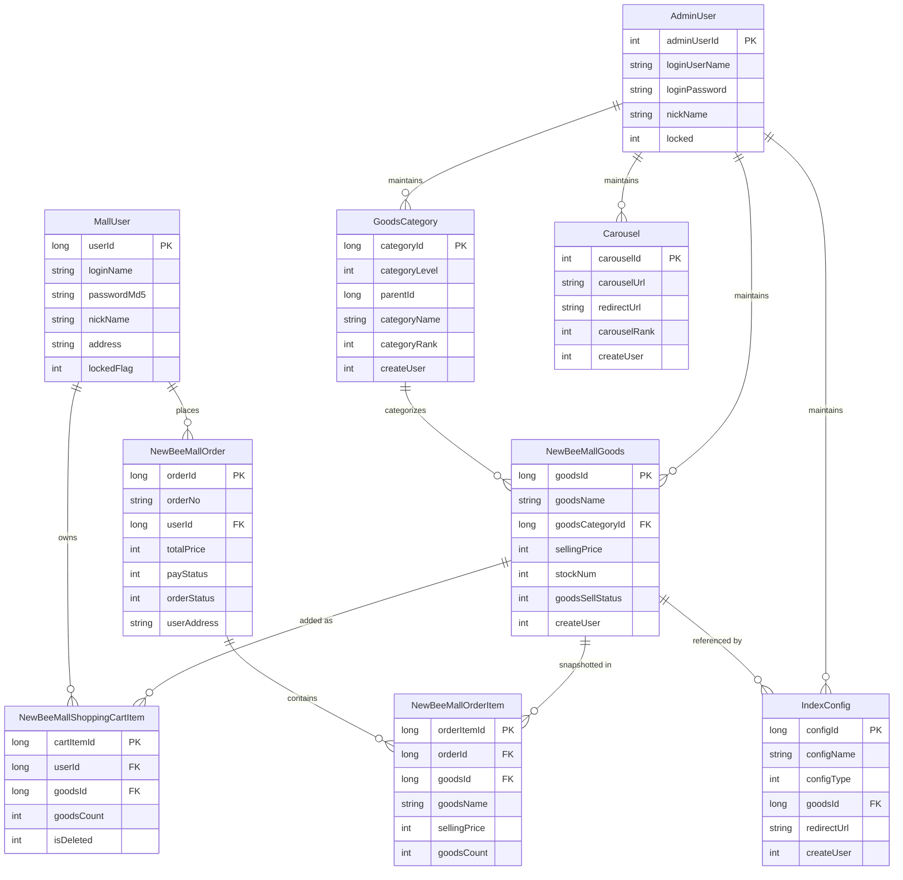

# Data Architecture & Persistence Layer

The data layer is centered on a single MySQL schema with MyBatis mapper interfaces/XML for persistence. Core entities cover users, catalog, cart, orders, and homepage content configuration.

## Database Configuration

| Service/Module | DB Type | Profile | Driver | Connection | Migration Tool |
|---|---|---|---|---|---|
| newbee-mall | MySQL | default | `com.mysql.cj.jdbc.Driver` | JDBC URL to `localhost:3306/newbee_mall_db` with HikariCP | SQL bootstrap script (`newbee_mall_schema.sql`) |

## Data Ownership per Service

| Service | Tables Owned | ORM Framework | Caching | Notes |
|---|---|---|---|---|
| newbee-mall | `tb_newbee_mall_admin_user`, `tb_newbee_mall_user`, `tb_newbee_mall_goods_info`, `tb_newbee_mall_goods_category`, `tb_newbee_mall_shopping_cart_item`, `tb_newbee_mall_order`, `tb_newbee_mall_order_item`, `tb_newbee_mall_carousel`, `tb_newbee_mall_index_config` | MyBatis | none detected | Single shared schema for admin + mall domains |

## Entity Model

## Key Repository Methods

| Service | Repository | Notable Methods | Purpose |
|---|---|---|---|
| newbee-mall | `NewBeeMallOrderMapper` | `findNewBeeMallOrderList`, `selectByOrderNo`, `checkDone`, `checkOut`, `closeOrder` | Order list/query and status transitions |
| newbee-mall | `NewBeeMallOrderItemMapper` | `selectByOrderId`, `selectByOrderIds`, `insertBatch` | Load and persist order line snapshots |
| newbee-mall | `NewBeeMallGoodsMapper` | `findNewBeeMallGoodsListBySearch`, `updateStockNum`, `recoverStockNum`, `batchUpdateSellStatus` | Product search and inventory management |
| newbee-mall | `NewBeeMallShoppingCartItemMapper` | `selectByUserIdAndGoodsId`, `selectByUserId`, `deleteBatch` | User cart retrieval and cleanup |
| newbee-mall | `MallUserMapper` | `selectByLoginNameAndPasswd`, `lockUserBatch` | User authentication lookup and admin lock |
| newbee-mall | `GoodsCategoryMapper` | `selectByLevelAndParentIdsAndNumber`, `batchInsert` | Category hierarchy retrieval and maintenance |
| newbee-mall | `IndexConfigMapper`, `CarouselMapper`, `AdminUserMapper` | list/save/update/info methods | Homepage config and admin account persistence |

## Caching Strategy

No explicit application cache provider or cache annotations (`@Cacheable`, Redis, Caffeine, EhCache) were identified. The system appears to rely on direct database queries and HTTP session state.

## Data Ownership Boundaries

The repository implements a single-service topology with one shared MySQL schema. All bounded contexts (catalog, user, cart, order, homepage config, admin) read/write through the same datastore via mapper interfaces. There is no cross-service API/data replication pattern or CQRS split; read and write operations are managed transactionally inside service methods (notably order creation and status updates).

### Data Classification & Sensitivity

| Entity | Sensitive Fields | Classification (PII/PHI/PCI/None) | Controls in Place |
|---|---|---|---|
| `MallUser` | `loginName`, `nickName`, `address`, `passwordMd5` | PII | Password stored as MD5 hash; no field-level encryption/masking config identified |
| `AdminUser` | `loginUserName`, `loginPassword`, `nickName` | PII | Password stored as hashed string in seed data; no explicit masking/encryption-at-rest controls in repo |
| `NewBeeMallOrder` | `userAddress` | PII | No explicit masking or encryption controls identified |
| `NewBeeMallOrderItem`, `NewBeeMallGoods`, `GoodsCategory`, `Carousel`, `IndexConfig`, `NewBeeMallShoppingCartItem` | business/product metadata | None or low sensitivity | Standard DB persistence only |

No PHI or PCI data fields were explicitly detected in the entity model.
