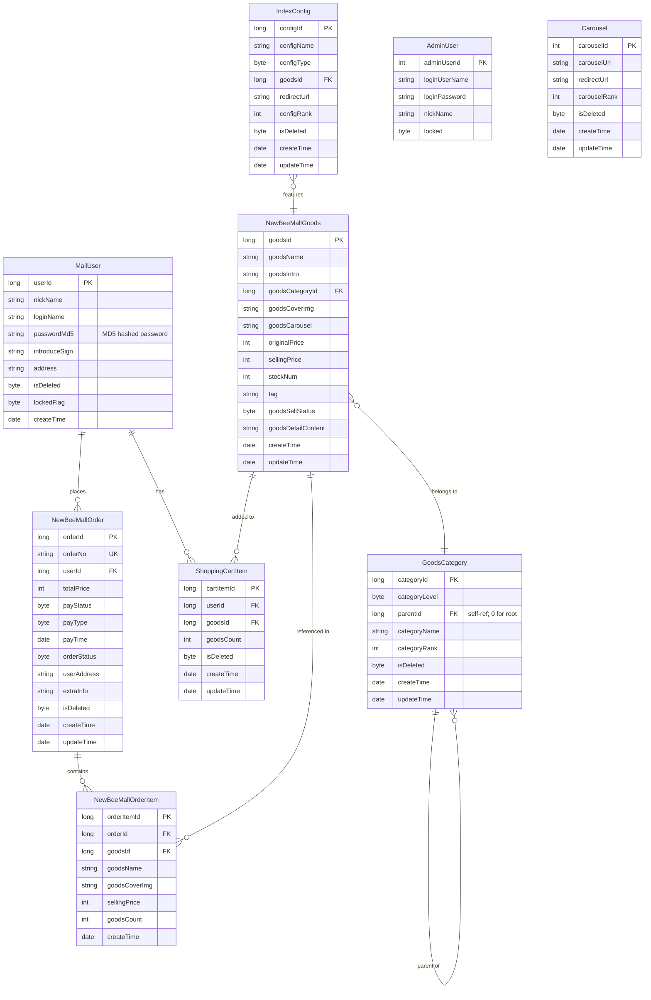

# Data Architecture & Persistence Layer

**newbee-mall** manages **9 entities** mapped via MyBatis XML mappers against a single MySQL database (`newbee_mall_db`), with no ORM framework (no JPA/Hibernate) and no caching layer.

## Database Configuration

| Service/Module | DB Type | Profile | Driver | Connection | Migration Tool |
|---|---|---|---|---|---|
| newbee-mall (monolith) | MySQL | default (single profile) | com.mysql.cj.jdbc.Driver (mysql-connector-java) | localhost:3306/newbee_mall_db, HikariCP pool (min 5, max 15, timeout 30 s) | None — no Flyway, Liquibase, or DDL auto-generation; schema must be applied manually |

No profile-based database switching is configured. The application runs with a single datasource pointing to a local MySQL instance. Schema is managed manually — no migration tool is in use. There are no seed data scripts (`data.sql`, `import.sql`) in the project.

## Data Ownership per Service

| Service | Tables Owned | ORM Framework | Caching | Notes |
|---|---|---|---|---|
| newbee-mall (monolith) | tb_newbee_mall_admin_user, tb_newbee_mall_user, tb_newbee_mall_goods, tb_newbee_mall_goods_category, tb_newbee_mall_order, tb_newbee_mall_order_item, tb_newbee_mall_shopping_cart_item, tb_newbee_mall_carousel, tb_newbee_mall_index_config | MyBatis 2.2.2 (XML mappers) | None | Single module; all tables in one shared schema |

## Entity Model

## Key Repository Methods

| Mapper | Entity | Notable Custom Methods | Purpose |
|---|---|---|---|
| AdminUserMapper | AdminUser | `login(userName, password)` | Authenticates admin by username + plain-text password comparison |
| MallUserMapper | MallUser | `selectByLoginName(loginName)`, `selectByLoginNameAndPasswd(loginName, password)`, `lockUserBatch(ids, lockStatus)` | User lookup and bulk account lock/unlock |
| NewBeeMallGoodsMapper | NewBeeMallGoods | `selectByPrimaryKeys(goodsIds)`, `updateStockNum(stockNumDTOS)`, `recoverStockNum(stockNumDTOS)`, `batchUpdateSellStatus(orderIds, sellStatus)`, `findNewBeeMallGoodsListBySearch(pageUtil)` | Batch stock adjustment during order create/cancel; keyword search pagination |
| NewBeeMallOrderMapper | NewBeeMallOrder | `selectByOrderNo(orderNo)`, `selectByPrimaryKeys(orderIds)`, `checkDone(orderIds)`, `checkOut(orderIds)`, `closeOrder(orderIds, orderStatus)` | Bulk order status transitions (admin operations) |
| NewBeeMallOrderItemMapper | NewBeeMallOrderItem | `selectByOrderId(orderId)`, `selectByOrderIds(orderIds)`, `insertBatch(orderItems)` | Bulk insert on order creation; bulk fetch for admin order detail view |
| NewBeeMallShoppingCartItemMapper | NewBeeMallShoppingCartItem | `selectByUserIdAndGoodsId(userId, goodsId)`, `selectByUserId(userId, number)`, `selectCountByUserId(userId)`, `deleteBatch(ids)` | Duplicate-check before add-to-cart; cart item count for header badge |
| GoodsCategoryMapper | GoodsCategory | `selectByLevelAndParentIdsAndNumber(parentIds, level, number)`, `selectByLevelAndName(level, name)` | Three-level category tree retrieval; duplicate name check |
| CarouselMapper | Carousel | `findCarouselsByNum(number)`, `deleteBatch(ids)` | Homepage carousel fetch by display limit; batch delete |
| IndexConfigMapper | IndexConfig | `findIndexConfigsByTypeAndNum(configType, number)`, `selectByTypeAndGoodsId(configType, goodsId)` | Homepage featured-goods fetch by type; duplicate check |

All data access is done through plain MyBatis mapper interfaces backed by XML files in `classpath:mapper/`. There is no `@Transactional` annotation usage at the service layer; transaction boundaries rely on MyBatis's default auto-commit behavior (disabled by HikariCP's `auto-commit=true` at the connection level, but no explicit Spring transaction management is applied to multi-step operations such as order creation + stock decrement).

## Caching Strategy

**No caching layer is implemented.** There is no Spring Cache (`@Cacheable`), no Redis, no EhCache, no Caffeine, and no second-level MyBatis cache configured. Every read request — including high-frequency homepage queries (carousels, category tree, featured goods) — executes a direct SQL query against MySQL. This represents a significant performance concern at scale.

## Data Ownership Boundaries

All nine tables reside in a single shared MySQL schema (`newbee_mall_db`), owned and accessed exclusively by the single monolithic application. There are no cross-service data access concerns, no database-per-service patterns, and no logical data boundary separation.

The `NewBeeMallOrderServiceImpl` is the only component that performs cross-entity writes in a single logical operation: it reads cart items, fetches goods stock, decrements stock (`updateStockNum`), creates the order record, inserts order items (`insertBatch`), and deletes cart items — all without an explicit `@Transactional` boundary, which creates a risk of data inconsistency if any step fails partway through.

### Data Classification & Sensitivity

| Entity | Sensitive Fields | Classification | Controls in Place |
|---|---|---|---|
| MallUser | loginName, nickName, address, passwordMd5 | PII | None — no encryption-at-rest, no field masking, no TLS; password stored as unsalted MD5 hash |
| NewBeeMallOrder | userAddress, userId | PII | None — delivery address stored in plaintext; no encryption or masking |
| AdminUser | loginUserName, loginPassword | Credentials | None — admin password stored as plain string; no hashing visible in entity or mapper |

**Summary:** The application stores PII (user login name, address) and credentials (admin password, user MD5 password hash) with no encryption-at-rest, no field-level access controls, and no data masking. Passwords are stored as MD5 hashes (user) or possibly plaintext (admin), both of which are insecure. No transport security (HTTPS/TLS) is configured.
