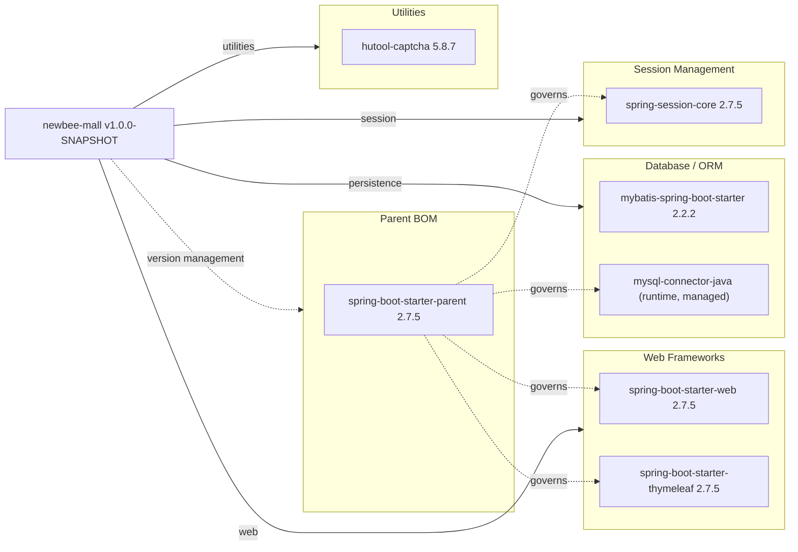

# Dependency Map

**newbee-mall** is a Spring Boot 2.7.5 e-commerce application with **7 declared dependencies** (6 production + 1 test-scoped), all managed under the Spring Boot parent BOM.

## Dependencies

### Dependency Summary

| Category | Count | Key Libraries | Notes |
|---|---|---|---|
| Web Frameworks | 2 | spring-boot-starter-web 2.7.5, spring-boot-starter-thymeleaf 2.7.5 | Monolithic server-side rendering; no REST/JSON API layer |
| Database / ORM | 2 | mybatis-spring-boot-starter 2.2.2, mysql-connector-java (runtime) | XML-based SQL mapping; no JPA/ORM abstraction |
| Session Management | 1 | spring-session-core 2.7.5 | In-memory HTTP session; no distributed store |
| Utilities | 1 | hutool-captcha 5.8.7 | Image captcha generation only |

### Version & Compatibility Risks

Spring Boot **2.7.5** reached end-of-life in November 2023; the current stable release is 3.x. The application targets **Java 8** (`<java.version>1.8</java.version>`), which is in long-term support but is three major versions behind Java 21 LTS. Migrating to Spring Boot 3.x would require a minimum Java 17 upgrade and the replacement of `javax.*` namespace imports with `jakarta.*` throughout the codebase. **mybatis-spring-boot-starter 2.2.2** is an older 2.x release; MyBatis Spring Boot 3.x aligns with Spring Boot 3. **mysql-connector-java** (the legacy Connector/J artifact) was superseded by `com.mysql:mysql-connector-j` starting with version 8.0.31 — the legacy artifact is still functional but produces deprecation warnings with newer MySQL servers.

### Notable Observations

- **No caching layer**: There is no Redis, EhCache, or any other cache dependency. All reads hit MySQL directly, which may become a bottleneck at scale.
- **No security framework**: Authentication is implemented via plain `HandlerInterceptor` classes and MD5-hashed passwords (visible in `MD5Util.java`), with no Spring Security or any crypto library — this is a significant security concern.
- **Minimal dependency footprint**: Only 6 runtime dependencies, making the project straightforward to maintain but leaving several operational concerns (logging configuration, metrics, tracing) entirely to Spring Boot auto-configuration defaults.
- **No messaging or async processing**: There is no Kafka, RabbitMQ, or Spring Async dependency; all operations including order creation are synchronous within a single transaction boundary.

## Test Dependencies

| Framework | Version | Notes |
|---|---|---|
| spring-boot-starter-test | 2.7.5 (managed) | Bundles JUnit 5, Mockito, AssertJ, Spring Test |

Total test-scope dependencies: **1** declared (pulls in JUnit Jupiter, Mockito Core, AssertJ, Hamcrest, Spring Test, and JSONPath transitively via the starter).

No dedicated integration test framework (e.g., Testcontainers) or contract-testing library is declared. The project contains no test source files under `src/test/java`, suggesting the test infrastructure exists in name only and no automated tests are currently written.
