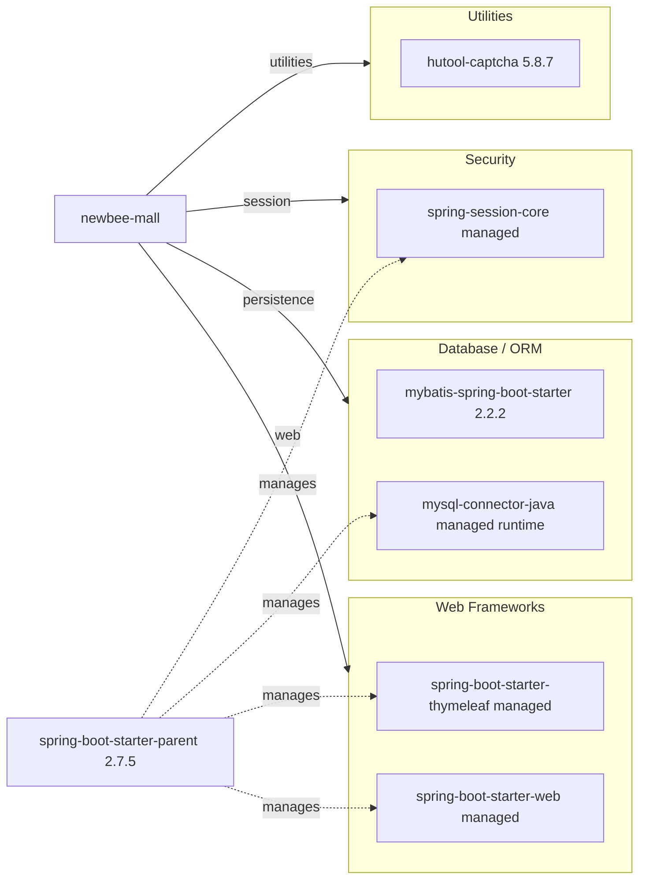

# Dependency Map

This document summarizes declared external dependencies for newbee-mall from `pom.xml` (excluding test dependencies from the main map). The project has 6 primary declared dependencies plus 1 test-scoped dependency.

## Dependencies

### Dependency Summary

| Category | Count | Key Libraries | Notes |
|---|---:|---|---|
| Web Frameworks | 2 | spring-boot-starter-web, spring-boot-starter-thymeleaf | MVC + server-side rendering |
| Database / ORM | 2 | mybatis-spring-boot-starter, mysql-connector-java | Mapper-based persistence to MySQL |
| Security | 1 | spring-session-core | Session infrastructure used by login flows |
| Utilities | 1 | hutool-captcha | Captcha generation/verification |

### Version & Compatibility Risks

The project targets Java 8 while using Spring Boot 2.7.5, which is stable but on an older major line compared with current Spring Boot generations. Future modernization may require dependency and API upgrades for newer JDK targets and long-term support alignment.

### Notable Observations

- Spring Boot parent BOM centrally manages versions for several starters and runtime components.
- MyBatis is used instead of JPA/Hibernate, so SQL and mapper XML compatibility is critical for upgrades.
- No explicit observability, messaging, caching, or circuit-breaker libraries are declared.
- Security dependency footprint is minimal and centered on session handling.

## Test Dependencies

| Framework | Version | Notes |
|---|---|---|
| spring-boot-starter-test | managed by Spring Boot 2.7.5 BOM | Provides JUnit and Spring test utilities |

Total test-scope dependencies: 1

Test infrastructure is basic and Spring Boot standard. No specialized integration-test libraries (e.g., Testcontainers) are declared in this module.
